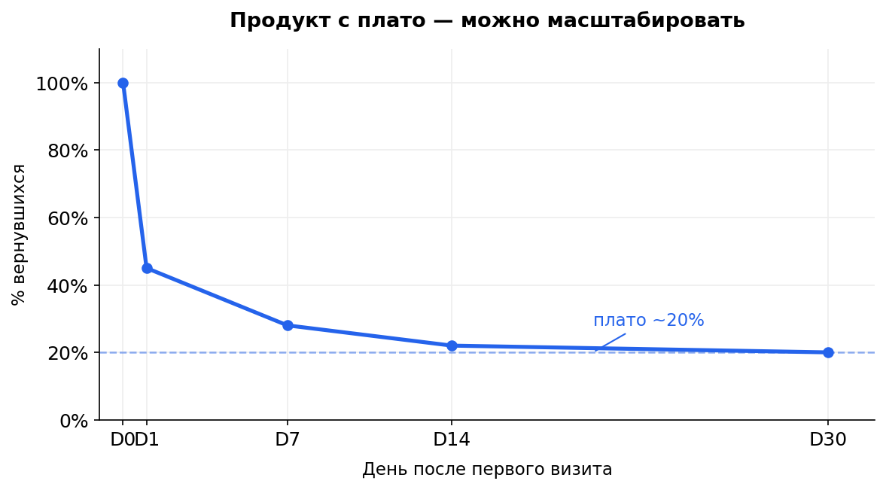
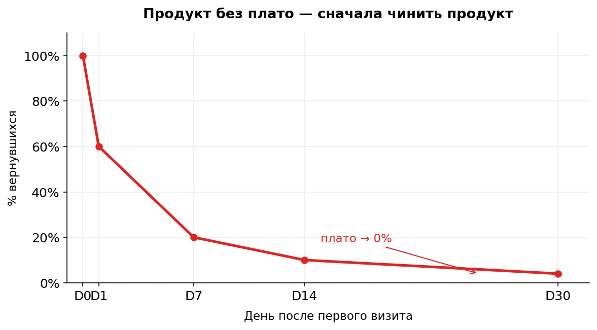

# 1.2 Retention, PMF и Aha-moment

Retention — одна из самых важных метрик в продуктовой аналитике. Без неё нельзя говорить о ценности продукта, масштабировании и принимать осмысленные решения о росте.

> 📌 **Контекст:** Маркетинг привёл 100 000 новых пользователей за месяц. Звучит как победа — пока ты не увидишь, что через неделю 95% из них исчезли. Retention отвечает на вопрос, которого боится каждый продакт: «Возвращаются ли люди после первого визита — или мы просто сжигаем бюджет?»

---

## Зачем нужен retention

> 💡 **Главная мысль:** Retention отвечает на ключевой вопрос: **возвращаются ли пользователи за ценностью?** Высокий DAU без retention — это рост за счёт трафика, а не продукта.

Можно иметь высокий DAU, растущий MAU и большой рекламный бюджет. Но если пользователи не возвращаются — продукт не удерживает ценность, и масштабировать его бессмысленно.

---

## Что такое retention и как считать

**Retention** — доля пользователей, вернувшихся в продукт через N дней после первого визита.

> Retention Day N = вернувшиеся в день N ÷ пользователи когорты

**Пользователи когорты** — те, кто пришёл впервые в день 0 (день старта когорты). Это знаменатель — он фиксируется один раз и не меняется.

Примеры:
- D1 retention — вернулись на следующий день
- D7 retention — вернулись через 7 дней
- D30 retention — вернулись через 30 дней

Важно: retention считается **по когортам**, а не по всем пользователям сразу. Один пользователь считается один раз, даже если зашёл несколько раз за день.

> ⚠️ **Типичная ошибка:** Считать retention по всем пользователям без разбивки по когортам. Так ты смешиваешь новых и старых пользователей и получаешь бессмысленную среднюю температуру.

---

## Плато retention

Retention почти всегда быстро падает в первые дни, потом выравнивается.

> 💡 **Главная мысль:** Наличие плато — главный признак того, что у продукта есть ценность и ядро лояльных пользователей. Без плато масштабировать продукт бессмысленно.

| Ситуация | Что значит |
|----------|-----------|
| Плато > 0% | Есть ядро пользователей, продукт можно масштабировать |
| Плато → 0% | Продукт не удерживает ценность, сначала чинить продукт |

Как выглядит на графике:

---

## Product Market Fit (PMF)

**Product Market Fit** — момент, когда продукт нашёл свой рынок: достаточно пользователей получают реальную ценность и стабильно возвращаются за ней.

> 💡 **Главная мысль:** Стабильное плато retention — главный количественный сигнал PMF. Нет плато — PMF не достигнут, и масштабировать маркетинг значит ускорять слив бюджета.

Как retention говорит о PMF:

| Сигнал | Что значит |
|--------|-----------|
| Плато устойчиво > 0% | PMF есть — продукт ценен для своего ядра |
| Плато растёт от когорты к когорте | PMF усиливается, продукт улучшается |
| Плато → 0% | PMF не достигнут |

**Ориентиры по типам продуктов** (не жёсткие правила, контекст важнее):

| Тип продукта | D30 retention |
|-------------|--------------|
| Мессенджеры, соцсети | > 25% |
| E-commerce | > 10% |
| SaaS B2B (M6) | > 65% |
| Контент, медиа | > 15% |

**Альтернативный способ — опрос Sean Ellis:**
Вопрос пользователям: «Насколько вы были бы разочарованы, если бы этот продукт исчез?»
Если >40% отвечают «очень разочарован» — сигнал PMF.

> ⚠️ **Типичная ошибка:** Объявить PMF по одному хорошему месяцу или по росту DAU. PMF — это устойчивый паттерн в нескольких когортах, а не разовый всплеск.

---

## Aha-moment

**Aha-moment** — действие, после которого вероятность возврата резко возрастает. Момент, когда пользователь почувствовал ценность продукта.

Примеры:
- Мессенджер → отправил первое сообщение
- Маркетплейс → получил первый заказ
- Образовательный сервис → прошёл первый урок и увидел результат

> 💡 **Главная мысль:** Retention показывает **возвращаются ли** пользователи. Aha-moment объясняет **почему** — это действие, после которого вероятность возврата резко растёт. Задача продуктовой команды — находить Aha-moment и увеличивать долю пользователей, которые до него доходят.

---

## Аналогия с дырявым ведром

Представь: ты постоянно льёшь воду (привлекаешь трафик), но в ведре дыра (низкий retention).

Сколько бы воды ты ни добавлял — уровень не растёт.

> ⚠️ **Типичная ошибка:** Масштабировать маркетинг при низком retention. Сначала нужно залатать дыры в продукте, только потом лить воду.

---

## Как визуализируют retention

**Линейная диаграмма** — ось X: дни после первого визита, ось Y: % вернувшихся. Показывает скорость оттока и наличие плато.

**Когортная тепловая карта** — строки: когорты по дате первого визита, столбцы: дни N. Позволяет сравнивать когорты: если нижние строки (более поздние когорты) светлее — retention улучшается.

[🎬 ВИДЕО: скринкаст — читаем retention-кривую и когортную тепловую карту ~5 мин]

---

## ★ Три типа retention

Развернуть

На собеседованиях могут спросить про разные способы расчёта.

**Classic retention** — вернулся ли пользователь **именно в день N**? Жёсткий критерий, чувствителен к сдвигам.

**Rolling retention** — вернулся ли пользователь **в день N или позже**? Устойчивее к колебаниям, всегда выше classic.

**Bracketed retention** — был ли активен **в интервале дней A–B**? Удобен для продуктов с нерегулярным сценарием.

На собеседовании достаточно: назвать тип + объяснить почему подходит под продукт.

---

## Кейсы с собеседований

**«Retention низкий, но DAU растёт. Это проблема?»**

Да. Рост DAU без роста retention — это рост за счёт трафика. Продукт не улучшается, просто приходит больше новых. Как только маркетинг замедлится — DAU начнёт падать.

**«Как улучшить retention?»**

Типовая ошибка — сразу предлагать фичи. Правильно: сначала понять где именно пользователи отваливаются, найти Aha-moment, увеличить долю тех, кто до него доходит. Фичи — потом.

---

> 🏪 **Сквозной кейс — Маркетплейс «М»**
>
> Retention «М»: D1=45%, D7=25%, D14=20%, D30=15%, далее плато ~12%.
>
> **Есть ли плато?** Да — retention стабилизируется на 12%. Есть ядро пользователей, которые регулярно возвращаются за покупками.
>
> **PMF?** Сигнал положительный: плато устойчиво > 0%, продукт можно масштабировать.
>
> **Aha-moment «М»:** получение первого заказа. Пользователь, который оформил и получил заказ, возвращается с вероятностью 3× выше, чем тот, кто только просматривал каталог. Задача — довести как можно больше новых пользователей до первого заказа.

---

> 🎯 **Практика:** Смотри на данные ниже и ответь на вопросы.
>
> Продукт А (доставка): D1=40%, D7=25%, D14=22%, D30=20%
> Продукт Б (новости): D1=60%, D7=15%, D14=8%, D30=3%
>
> 1. У какого продукта есть плато?
> 2. Какой можно масштабировать?
> 3. Что бы ты проверил в Продукте Б в первую очередь?

Разбор — на следующей странице.

---

➡️ **Дальше:** [1.3 Практика: Retention](1_3_practice_retention.md)
